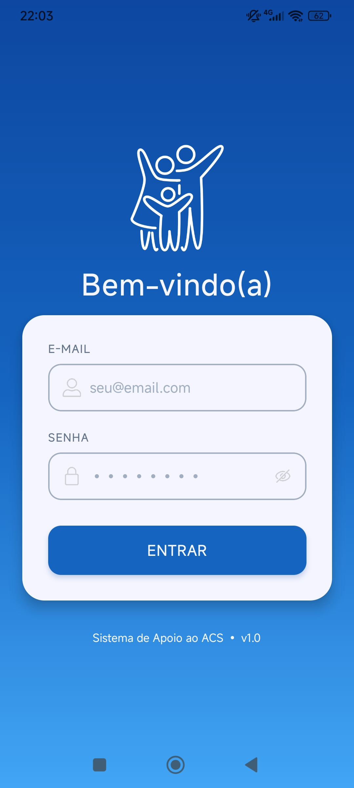
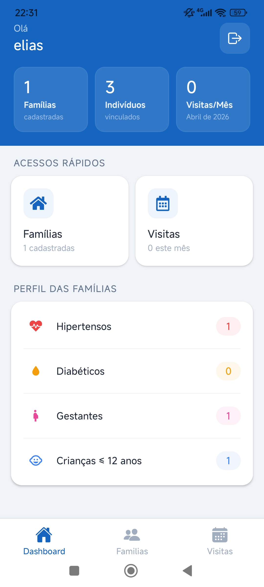
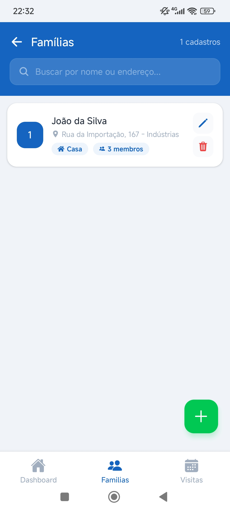
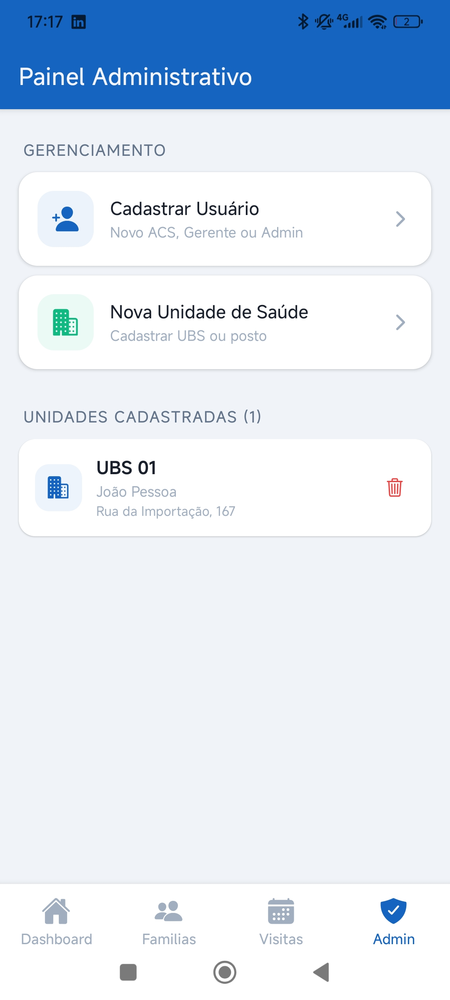
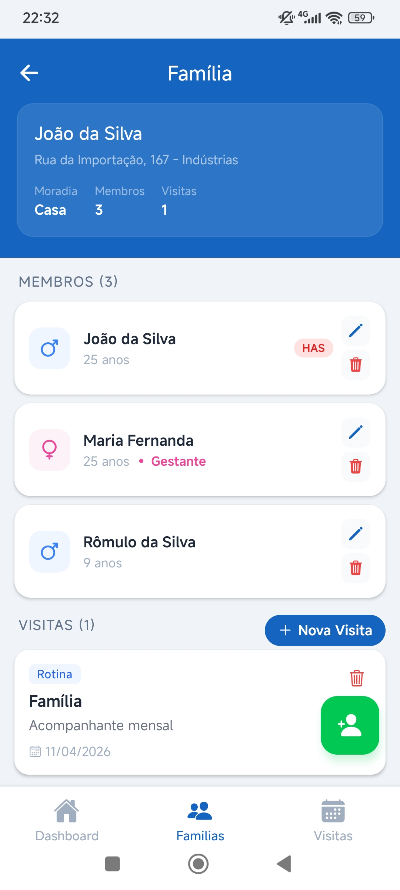
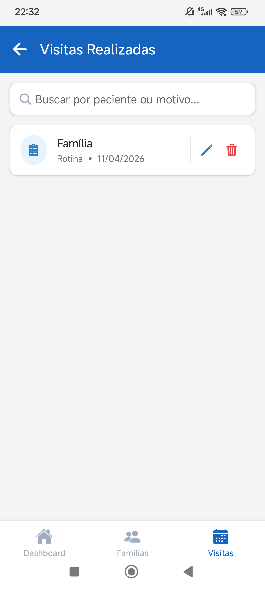
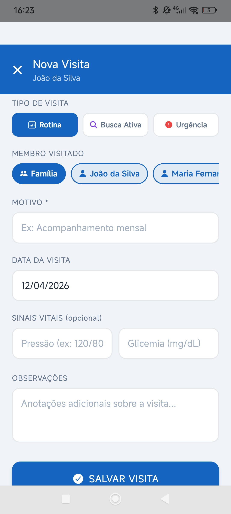
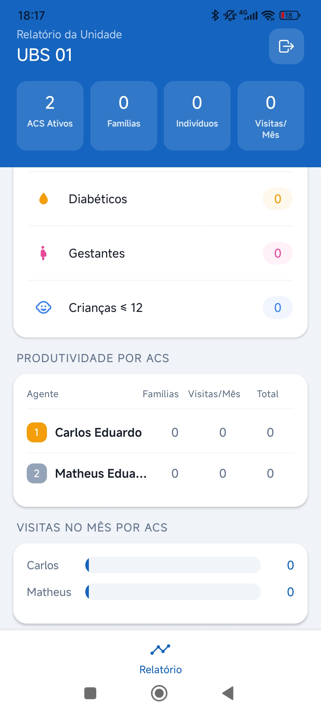

<p align="center">
  
</p>

<h1 align="center">Sistema de Apoio ao ACS</h1>

<p align="center">
  Aplicação mobile para Agentes Comunitários de Saúde do SUS: cadastro de famílias, acompanhamento de condições de saúde e registro de visitas domiciliares.
</p>

<p align="center">
  
  
  
  
</p>

## Sobre o Projeto

O **Sistema de Apoio ao ACS** é um aplicativo mobile desenvolvido para auxiliar Agentes Comunitários de Saúde (ACS) no registro e acompanhamento de famílias sob sua responsabilidade. O app permite o cadastro de domicílios, gestão de membros familiares com condições de saúde (hipertensão, diabetes, gestantes, crianças), e o registro de visitas domiciliares.

## Screenshots

<p align="center">
    
    &nbsp;&nbsp;
    
    &nbsp;&nbsp;
    
    &nbsp;&nbsp;
    
</p>

<p align="center">
  
  &nbsp;&nbsp;
  
  &nbsp;&nbsp;
  
  &nbsp;&nbsp;
  
</p>

## Funcionalidades

- **Autenticação:** Login com email/senha via Firebase Auth, com persistência de sessão
- **Dashboard:** Estatísticas em tempo real: famílias cadastradas, indivíduos vinculados, hipertensos, diabéticos, gestantes e crianças ≤ 12 anos
- **Cadastro de Famílias:** Registro com responsável, endereço e tipo de moradia
- **Gestão de Membros:** Cadastro de membros por família com nome, data de nascimento, sexo, condições de saúde e marcação de gestante
- **Visitas Domiciliares:** Registro com tipo de visita, motivo, aferições e observações
- **Painel Administrativo:** Cadastro de novos Agentes de Saúde (restrito ao perfil ADM)
- **Busca e Filtros:** Pesquisa por nome ou endereço na lista de famílias e visitas
- **Controle de Acesso:** Três perfis com permissões distintas: ACS, Gerente e Administrador

## Arquitetura

O projeto segue uma arquitetura em camadas com separação de responsabilidades:

<p align="center">
  
</p>

| Camada       | Responsabilidade                                  |
|------------- |---------------------------------------------------|
| Screens      | Interface do usuário e captura de interações      |
| Controllers  | Orquestração, validações e tradução de erros      |
| Services     | Comunicação direta com Firebase (Auth/Firestore)  |


## Controle de Acesso

| Ação                        | ACS | Gerente | ADM |
|-----------------------------|-----|---------|-----|
| Cadastrar famílias          | ✅  | —       | ✅ |
| Ver suas famílias           | ✅  | —       | ✅ |
| Registrar visitas           | ✅  | —       | ✅ |
| Ver dados da unidade        | —   | ✅      | ✅ |
| Cadastrar usuários          | —   | —       | ✅ |
| Ver dados do município      | —   | —       | ✅ |

## Como Executar

### Pré-requisitos

- [Node.js](https://nodejs.org) v18+ instalado
- [Expo Go](https://expo.dev/go) no celular Android
- Conta no [Firebase](https://console.firebase.google.com)

### Instalação

```bash
# Clone o repositório
git clone https://github.com/torres-elias/sistema-apoio-acs.git
cd sistema-apoio-acs

# Instale as dependências
npm install --legacy-peer-deps
```

### Configuração do Firebase

1. Crie um projeto no [Firebase Console](https://console.firebase.google.com)
2. Ative **Authentication** com método Email/Senha
3. Crie um banco **Firestore Database**
4. Registre um app Web e copie as credenciais
5. Crie o arquivo `.env` na raiz do projeto:

```env
EXPO_PUBLIC_API_KEY=sua_api_key
EXPO_PUBLIC_AUTH_DOMAIN=seu_projeto.firebaseapp.com
EXPO_PUBLIC_PROJECT_ID=seu_projeto
EXPO_PUBLIC_STORAGE_BUCKET=seu_projeto.firebasestorage.app
EXPO_PUBLIC_MESSAGING_SENDER_ID=seu_sender_id
EXPO_PUBLIC_APP_ID=seu_app_id
```

### Execução

```bash
npx expo start
```

Escaneie o QR code com o Expo Go no celular.

## Stack Tecnológica

| Tecnologia | Uso |
|-----------|-----|
| React Native | Framework mobile |
| Expo SDK 54 | Toolchain e desenvolvimento |
| Firebase Auth | Autenticação |
| Cloud Firestore | Banco de dados |

## Equipe

| Nome | GitHub |
|------|--------|
| Elias Torres | [@torres-elias](https://github.com/torres-elias)|
| Matheus Eduardo | [@MatheEduar](https://github.com/MatheEduar)|
| Carlos Eduardo | [@CarlosCosta72](https://github.com/CarlosCosta72)|
| Kalil Teotônio |[@Galill](https://github.com/Galill)|
| Francisco Marcolino |[@franciseven](https://github.com/franciseven)|
